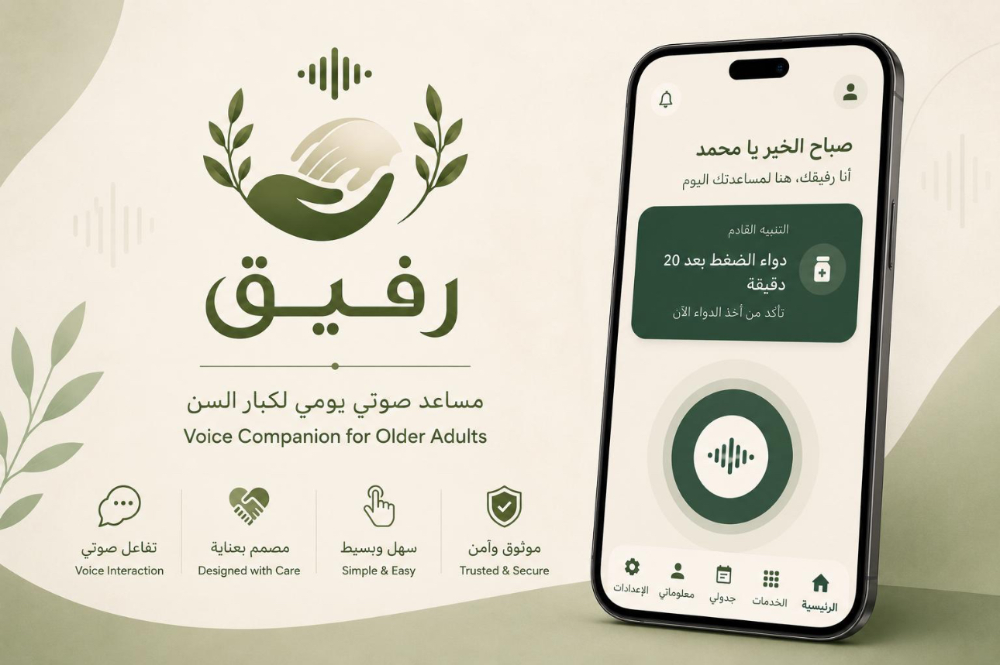

# Rafeeq | رفيق

<p align="center">
  
</p>

<p align="center">
  <strong>An accessible, AI-powered Arabic voice companion for older adults</strong>
</p>

> **Public project showcase:** This repository presents Rafeeq's concept, research, user experience, technical approach, and selected prototype materials. The latest full application source and service configuration are maintained privately.

## Overview

Rafeeq (رفيق) is a voice-first digital companion designed to help older adults in Saudi Arabia complete everyday tasks more easily and independently. It combines a simplified Arabic interface with Saudi Arabic voice interaction, AI-assisted intent understanding, reminders, religious services, family communication, and emergency support.

The project began with research into older adults' needs and accessibility challenges, then progressed through requirements analysis, interface design, data modeling, MVP development, testing, and a final live presentation.

**Status:** MVP / prototype completed in 2026.


## Key Features

- **Arabic voice interaction** — speech input, intent recognition, and spoken responses
- **Medication and appointment reminders** — simple support for daily schedules
- **Prayer times** — daily prayer information and reminder settings
- **Quran services** — access to Surahs with audio playback
- **Emergency support** — quick access to help and location-sharing options
- **Family contacts** — convenient communication with trusted family members
- **Nearby services** — assistance locating mosques, hospitals, and pharmacies
- **Memory games** — simple cognitive activities
- **Accessibility controls** — Arabic RTL layout, large elements, readable text, and reduced visual complexity

## AI & Voice Experience

```text
Arabic voice input
        ↓
Speech-to-Text
        ↓
AI intent understanding
        ↓
Requested action or service
        ↓
Arabic voice response
```

The interaction was designed to reduce navigation steps and make common services available through natural spoken Arabic.

## Technology

- **FlutterFlow / Flutter** — interface and MVP development
- **Firebase / Firestore** — backend services and application data
- **Gemini** — AI-assisted intent understanding and responses
- **Speech-to-Text (STT)** — Arabic voice transcription
- **Text-to-Speech (TTS)** — spoken Arabic output
- **Python** — API integration and smoke testing

## Accessibility Approach

Rafeeq was designed around the needs of older adults:

- Clear Arabic typography and right-to-left layout
- Large, recognizable controls
- Simple and consistent navigation
- High-priority services within easy reach
- Voice-first interaction
- Reduced visual and cognitive complexity

See the **[UI showcase](Rafeeq_UI_Showcase.md)** and **[FlutterFlow implementation notes](FlutterFlow_UI_Implementation.md)** for more detail.

## Research & Project Documentation

This repository includes selected project artifacts:

- [Interview and survey report](Rafeeq_Interview_and_Survey_Report.pdf)
- [Functional and non-functional requirements](Functional_and_NonFunctional_Requirements.md)
- [Business Model Canvas](Business%20Model%20Canvas%20%E2%80%94%20Rafeeq%20(%D8%B1%D9%81%D9%8A%D9%82).pdf)
- [FlutterFlow UI implementation](FlutterFlow_UI_Implementation.md)
- [UI showcase](Rafeeq_UI_Showcase.md)
- [ER diagram](rafeeq_er_diagram_updated%20(1).png)
- Intent and voice-interaction dataset
- [API smoke-test documentation](API_SMOKE_TESTS.md)

## Repository Structure

```text
Rafeeq-App/
├── dataset/                              # Intent and voice-interaction data
├── API_SMOKE_TESTS.md                    # AI and voice API test notes
├── FlutterFlow_UI_Implementation.md      # Interface implementation notes
├── Functional_and_NonFunctional_Requirements.md
├── Rafeeq_Interview_and_Survey_Report.pdf
├── Rafeeq_UI_Showcase.md
├── Business Model Canvas — Rafeeq (رفيق).pdf
├── rafeeq_er_diagram_updated (1).png
├── test_gemini.py
├── test_speech_to_text.py
└── test_text_to_speech.py
```

## العربية

**رفيق** هو مساعد رقمي صوتي صُمم لتسهيل استخدام الخدمات اليومية لكبار السن. يركز المشروع على التفاعل الصوتي باللغة العربية، وسهولة الاستخدام، ووضوح الواجهات، مع خدمات تشمل التذكيرات، ومواقيت الصلاة والقرآن، والتواصل مع العائلة، ودعم حالات الطوارئ.

---

**Rafeeq | رفيق — Technology designed with accessibility, simplicity, and companionship in mind.**
